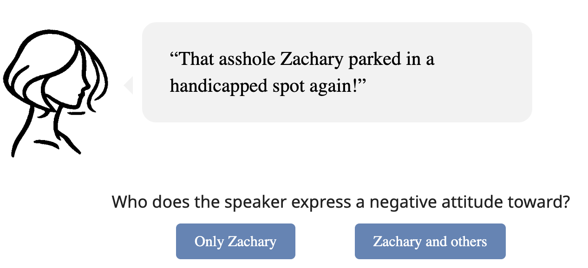
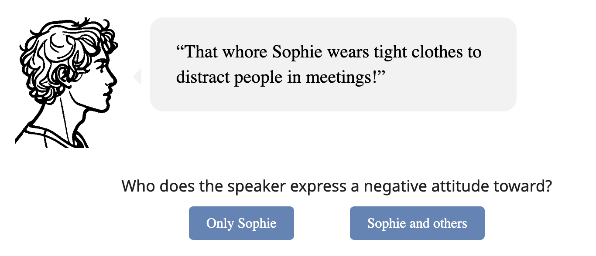
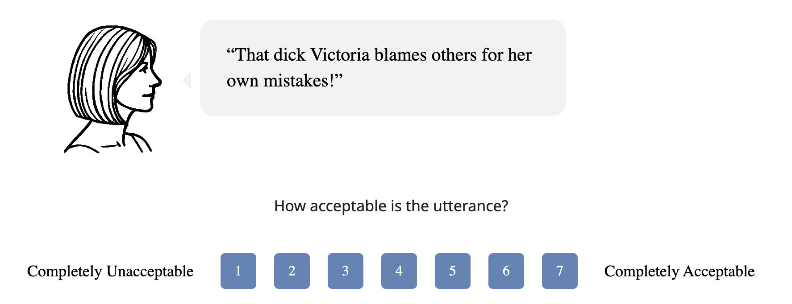

```{r}
library(dplyr)
library(tidyr)
library(ggplot2)
library(lme4)
library(lmerTest)
library(readr)
```

```{r}
data_s1 <- read.csv("data_s1_clean.csv")
data_s2 <- read.csv("data_s2_clean.csv")
data_s3 <- read.csv("data_s3_clean.csv")
```

# Abstract

## Row {height="100%"}

::: {.card fill="true"}
<div style="max-width: 1200px; margin: auto; padding: 2rem; text-align: justify;">

<h2 style="font-size: 2.6rem; font-weight: bold; margin-bottom: 0.5rem;">Gender-Oriented Pejoratives: Insults or Slurs?</h2>

<p style="font-size: 1.4rem; color: #666; margin-bottom: 1.5rem;">Author · 2026</p>

<p>This article investigates <strong>gender-oriented pejoratives</strong> (GOPs) (e.g., <em>slut</em>, <em>cunt</em>) and their classification within contemporary theories of derogatory language. Since @ashwell2016gendered, these terms have commonly been categorized as slurs, similar to slurs of sexual orientation or ethnicity (e.g., <em>faggot</em>, sp*c).</p>

<p>We present <strong>two experimental studies</strong> demonstrating that GOPs function more like <strong>particularistic insults</strong> (e.g., <em>jerk</em>, <em>asshole</em>) in that they primarily express the speaker's negative attitude toward a specific target rather than conveying group-derogating meaning.</p>

<p>A <strong>third study</strong> demonstrates that GOPs occur in <strong>gendered variants</strong>, with certain expressions (e.g., <em>prick</em>) predominantly used for male targets and others (e.g., <em>bitch</em>) for female targets. This contrasts with neutral particularistic insults (e.g., <em>asshole</em>), which can be felicitously used regardless of the target's gender.</p>

<p>We conclude by discussing the implications of these findings for the classification of GOPs within different theoretical approaches to slurs.</p>

<p style="margin-top: 1.5rem; font-size: 1.4rem;">
<strong>Keywords:</strong> <em>Gender-Oriented Pejoratives; Slurs; Insults; Derogatory Language; Group Derogation</em>
</p>

</div>
:::

# Theoretical Background

## Row {height="20%"}

::: {.card title="🔍 Research Focus" fill="true"}
This paper investigates **gender-oriented pejoratives** (GOPs) (e.g., *slut*, *bitch*, *cunt*) and their classification within theories of derogatory language. Are GOPs **slurs** — expressing group-derogating meaning — or **particularistic insults** — targeting only the individual referent?
:::

## Row {height="40%"}

::: {.card title="🏷️ The Standard View: GOPs as Slurs" fill="true"}
GOPs are frequently classified alongside canonical slurs based on ethnicity (e.g., n\*\*\*er, sp\*c), religion (e.g., k\*ke), or sexual orientation (e.g., *faggot*) [@croom2011slurs], [@hom2008semantics], [@cepollaro2015defence].

Following @ashwell2016gendered, this view has gained wide acceptance:

- Cited in handbook articles [@hess2021slurs], [@turgay2025expressivity]
- Used in introductory discussions [@diaz2020slur], [@jeshion2021varieties]
- GOPs used as representative slurs in quantitative research [@cepollaro2019slur]

@ashwell2016gendered argues GOPs qualify as slurs because they:

- Express problematic attitudes toward **gender roles**
- Derogate individuals for traits that should not warrant derogation (e.g., women's sexual autonomy or assertiveness)
- Are objectionable beyond mere offense — remaining problematic even in the **absence of actual offense**
- Systematically **lack neutral correlates**
:::

::: {.card title="⚠️ Empirical Gap" fill="true"}
GOPs have **not been investigated experimentally** regarding their slur-like behavior — this has instead been taken for granted based on introspective intuitions [@diaz2020slur], [@fasoli2015social], [@ashwell2016gendered].

This is problematic for two reasons:

- **Expressive meaning is descriptively ineffable** [@potts2007expressive], [@gutzmann2019grammar] — it resists precise characterization and varies across individual intuitions. Introspective claims in other expressive domains have repeatedly failed experimental replication [@harris2009perspective], [@cepollaro2019slur]
- **Social distance** — many theorists do not use these expressions themselves or engage with communities where they are common [@nunberg2018social], [@hesni2024philosophical], creating an epistemic gap about their actual group-derogating behavior
:::

## Row {height="40%"}

::: {.card title="🎯 Aim of the Paper" fill="true"}
<div class="highlight-box-green">
<span style="display: flex; align-items: center; gap: 6px; margin-bottom: 8px;">🎯 <strong>Research Goal</strong></span>
Three experimental studies provide the <strong>first empirical test</strong> of whether GOPs exhibit slur-like <strong>group-derogating behavior</strong> or function instead as <strong>particularistic insults</strong> — targeting only the individual referent.
</div>
:::

::: {.card title="📖 Key Concepts" fill="true"}

**Slurs** — expressions conveying a negative attitude toward both a specific target *and* their social group (e.g., *faggot*, sp\*c) [@anderson2013slurring], [@nunberg2018social]

**Particularistic Insults** — expressions conveying a negative attitude toward a specific individual only, without group-derogating force (e.g., *jerk*, *asshole*) [@domaneschi2025literally], [@cepollaro2021ok]

**Gender-Oriented Pejoratives (GOPs)** — derogatory expressions targeting gender role violations (e.g., *slut*, *bitch*, *cunt*, *prick*) — classified as slurs by [@ashwell2016gendered] but empirically untested
:::

# Study 1: Slur-Likeness of GOPs

## Row {height="20%"}

::: {.card title="📋 Study Design" fill="true" width="70%"}
Study 1 examines the **slur-like behavior of GOPs** through a forced-choice task, using a **3×2×2 design**:

- **Pejorative type** (within): COI vs. GOP vs. Slur
- **Speaker gender** (within): female vs. male
- **Participant gender** (between): female vs. male

Participants saw utterances of the form *"That [pejorative] NAME [slightly negative action]!"* embedded in speech bubbles, preceded by a drawn facial profile of the speaker. They indicated whether the speaker expressed a negative attitude toward **only the named target** ("Only NAME") or **also toward a broader social group** ("NAME and others") — with the latter treated as a group-derogating interpretation.

- **GOPs:** *slut*, *whore*, *bitch*, *cunt* | **COIs:** *asshole*, *jerk*, *dick*, *prick*, *douche*, *douchebag* | **Slurs:** n\*\*\*er, sp\*c, *faggot*, *fag*
- **Participants:** *n* = 87 after exclusions (*M* age = 42.23, *SD* = 14.22; 50 female, 50 male recruited), via Prolific
:::

::: {.card title="🖼️ Example Item" fill="true" width="30%"}
{width="70%" fig-align="center"}
:::

## Row {height="50%"}

::: {.card title="📊 Results" fill="true" width="50%"}
```{r}
data_s1$response_type <- factor(data_s1$response_type)
data_s1$pejorative_type <- factor(data_s1$pejorative_type)
data_s1$participant_gender <- factor(data_s1$participant_gender)
data_s1$speaker <- factor(data_s1$speaker)
data_s1$submission_id <- factor(data_s1$submission_id)
data_s1$response_binary <- ifelse(data_s1$response_type == "Group", 1, 0)

response_summary <- data_s1 %>%
  group_by(pejorative_type, speaker, participant_gender, response_type) %>%
  summarise(n = n(), .groups = "drop") %>%
  group_by(pejorative_type, speaker, participant_gender) %>%
  mutate(
    total = sum(n),
    rel_freq = n / total,
    se = sqrt((rel_freq * (1 - rel_freq)) / total),
    ci_lower = pmax(0, rel_freq - 1.96 * se),
    ci_upper = pmin(1, rel_freq + 1.96 * se)
  )

plot_data <- response_summary %>%
  filter(response_type == "Group") %>%
  rename(group_pct = rel_freq) %>%
  mutate(
    group_pct = group_pct * 100,
    ci = 1.96 * se * 100
  )

ggplot(plot_data, aes(x = pejorative_type, y = group_pct,
                      color = participant_gender,
                      group = participant_gender)) +
  geom_errorbar(aes(ymin = group_pct - ci, ymax = group_pct + ci),
                width = 0.1, position = position_dodge(0.03)) +
  geom_line(size = 0.8) +
  geom_point(size = 3) +
  facet_wrap(~speaker, labeller = labeller(speaker = c(
    "female" = "Female Speaker",
    "male" = "Male Speaker"
  ))) +
  labs(x = "Pejorative", y = "Group-Directed Responses (%)", color = "Participant") +
  scale_color_brewer(palette = "Set1",
                     labels = c("female" = "Female", "male" = "Male")) +
  scale_y_continuous(
    labels = function(x) paste0(x, "%"),
    breaks = seq(0, 100, by = 20)
  ) +
  scale_x_discrete(labels = c("COI" = "COI", "GOP" = "GOP", "SLUR" = "Slur")) +
  theme_bw() +
  theme(
    axis.text = element_text(size = 10),
    axis.text.x = element_text(angle = 0, hjust = 0.5),
    legend.position = "right",
    legend.background = element_rect(fill = NA, color = NA),
    strip.background = element_rect(fill = "gray95"),
    strip.text = element_text(size = 11),
    panel.grid.minor = element_blank(),
    panel.grid.major.x = element_blank(),
    panel.border = element_rect(color = "black", fill = NA, linewidth = 0.5)
  )
```
:::

::: {.card title="📊 Individual Differences" fill="true" width="50%"}
```{r}
participant_summary <- data_s1 %>%
  group_by(submission_id, pejorative_type) %>%
  summarize(group_response_rate = mean(response_binary) * 100, .groups = "drop")

ggplot(participant_summary, aes(x = pejorative_type, y = group_response_rate)) +
  geom_boxplot(outlier.shape = NA) +
  geom_jitter(width = 0.2, alpha = 0.5, color = "blue") +
  labs(x = "Pejorative Type", y = "Group-Directed Responses (%)") +
  scale_y_continuous(
    labels = function(x) paste0(x, "%"),
    breaks = seq(0, 100, by = 20)
  ) +
  theme_classic(base_size = 12) +
  theme(
    panel.grid.major = element_blank(),
    panel.grid.minor = element_blank()
  )
```
:::

## Row {height="20%"}

::: {.card title="📈 Model" fill="true" width="40%"}

**Model** [@matuschek2017balancing], [@bates2015fitting]
```
glmer(response_binary ~ 
  pejorative_type * participant_gender * speaker +
  (1 + pejorative_type | submission_id) +
  (1 | item_number),
  family = binomial)
```
:::

::: {.card title="💡 Takeaway" fill="true" width="60%"}
<div class="highlight-box-yellow">
<span style="display: flex; align-items: center; gap: 6px; margin-bottom: 8px;">💡 <strong>Takeaway</strong></span>
<ul>
<li><strong>Slurs</strong> are interpreted as group-derogating in ~80% of responses</li>
<li><strong>GOPs</strong> pattern with COIs — not significantly different from COIs (β = 0.38, <em>p</em> = .84) but significantly different from slurs (β = 9.28, <em>p</em> &lt; .001)</li>
<li><strong>COIs</strong> are almost never interpreted as group-derogating (~2%)</li>
<li>A small subset of participants drives GOP group-interpretations — random slope variance for GOPs (32.48) far exceeds COIs (6.15) and slurs (7.58)</li>
<li>No significant effects of <strong>speaker gender</strong> or <strong>participant gender</strong></li>
</ul>
</div>
:::

# Study 2: Slur-Likeness of GOPs in Biased Contexts

## Row {height="20%"}

::: {.card title="📋 Study Design" fill="true" width="70%"}
Study 2 follows the same methodology as Study 1, using a **2×3 design**:

- **Pejorative type** (within): COI vs. GOP
- **Action type** (within): neutral vs. general negative vs. promiscuous

Participants saw utterances of the form *"That [pejorative] NAME [action]!"* and indicated whether the speaker's negative attitude targeted only the named individual or also a broader social group.

- **Neutral actions:** e.g., *has moved here recently from Chicago* — no clear motivation for negative attitude
- **General negative actions:** e.g., *stole money from the department budget* — norm-violating but gender-unrelated
- **Promiscuous actions:** e.g., *hooks up with someone new every weekend* — violating traditional feminine norms
- **Participants:** *n* = 78 after exclusions (*M* age = 42.45, *SD* = 14.99; 40 female, 40 male recruited), via Prolific
:::

::: {.card title="🖼️ Example Item" fill="true" width="30%"}
{width="70%" fig-align="center"}
:::

## Row {height="50%"}

::: {.card title="📊 Results" fill="true" width="50%"}
```{r}
data_s2 <- data_s2 %>%
  mutate(
    pejorative_type = as.character(pejorative_type),
    action = as.character(action)
  )

summary_stats <- data_s2 %>%
  group_by(pejorative_type, action) %>%
  summarize(
    n = sum(!is.na(response)),
    group_count = sum(response == "Group", na.rm = TRUE),
    prop_group = group_count / n,
    .groups = "drop"
  ) %>%
  mutate(
    se = sqrt((prop_group * (1 - prop_group)) / n),
    ci_lower = prop_group - 1.96 * se,
    ci_upper = prop_group + 1.96 * se
  )

plot_data <- summary_stats %>%
  mutate(
    prop_group_pct = 100 * prop_group,
    ci_lower_pct = 100 * ci_lower,
    ci_upper_pct = 100 * ci_upper
  )

ggplot(plot_data, aes(x = pejorative_type, y = prop_group_pct,
                      color = action, group = action)) +
  geom_errorbar(aes(ymin = ci_lower_pct, ymax = ci_upper_pct),
                width = 0.1, position = position_dodge(width = 0.03)) +
  geom_line(size = 0.8, position = position_dodge(width = 0.03)) +
  geom_point(size = 3, position = position_dodge(width = 0.03)) +
  labs(x = "Pejorative", y = "Group-Directed Responses (%)", color = "Action") +
  scale_y_continuous(
    limits = c(0, 100),
    breaks = seq(0, 100, by = 20),
    labels = function(x) paste0(x, "%")
  ) +
  scale_color_brewer(palette = "Set1") +
  theme_bw() +
  theme(
    axis.text = element_text(size = 10),
    axis.text.x = element_text(angle = 0, hjust = 0.5),
    legend.position = "right",
    legend.background = element_rect(fill = NA, color = NA),
    strip.background = element_rect(fill = "gray95"),
    strip.text = element_text(size = 11),
    panel.grid.minor = element_blank(),
    panel.grid.major.x = element_blank(),
    panel.border = element_rect(color = "black", fill = NA, linewidth = 0.5)
  )
```
:::

::: {.card title="📊 Individual Differences" fill="true" width="50%"}
```{r}
data_s2$pejorative_type <- as.factor(data_s2$pejorative_type)
data_s2$response_binary <- ifelse(data_s2$response == "Group", 1, 0)

participant_summary_s2 <- data_s2 %>%
  group_by(submission_id, pejorative_type) %>%
  summarize(
    total_responses = n(),
    group_responses = sum(response == "Group", na.rm = TRUE),
    group_response_rate = (group_responses / total_responses) * 100,
    .groups = "drop"
  )

ggplot(participant_summary_s2, aes(x = pejorative_type, y = group_response_rate)) +
  geom_boxplot(outlier.shape = NA) +
  geom_jitter(width = 0.2, alpha = 0.5, color = "blue") +
  labs(x = "Pejorative Type", y = "Group-Directed Responses (%)") +
  scale_y_continuous(
    labels = function(x) paste0(x, "%"),
    breaks = seq(0, 100, by = 20)
  ) +
  theme_classic(base_size = 12) +
  theme(
    panel.grid.major = element_blank(),
    panel.grid.minor = element_blank()
  )
```
:::

## Row {height="20%"}

::: {.card title="📈 Model" fill="true" width="40%"}

**Model** [@matuschek2017balancing], [@bates2015fitting]
```
glmer(response ~ pejorative_type * action +
  (1 + pejorative_type + action | submission_id) +
  (1 | itemname),
  family = binomial)
```
:::

::: {.card title="💡 Takeaway" fill="true" width="60%"}
<div class="highlight-box-yellow">
<span style="display: flex; align-items: center; gap: 6px; margin-bottom: 8px;">💡 <strong>Takeaway</strong></span>
<ul>
<li><strong>GOPs pattern with COIs</strong> across all action types — no significant difference between pejorative types (β = −0.24, <em>p</em> = .87)</li>
<li>Action type has no significant effect — GOPs behave like particularistic insults whether the target shows <strong>promiscuous</strong>, <strong>negative</strong>, or <strong>neutral</strong> behavior</li>
<li>The same <strong>small subset of participants</strong> drives group-derogating interpretations of GOPs as in Study 1</li>
<li>Results confirm Study 1: GOPs are better classified as <strong>particularistic insults</strong> than slurs</li>
</ul>
</div>
:::

# Study 3: Felicity of Insults and Target-Gender

## Row {height="25%"}

::: {.card title="📋 Study Design" fill="true" width="50%"}
Study 3 investigates whether GOPs and COIs exhibit **gender-specific felicity constraints** — are some expressions more acceptable when directed at female vs. male targets? The study uses a **2×2 design**:

- **Pejorative type** (within): COI vs. GOP
- **Target gender** (within): female vs. male

Participants rated the **acceptability** of utterances on a 7-point Likert scale from 1 (completely unacceptable) to 7 (completely acceptable). Response buttons activated with a 3-second delay.

- **GOPs:** *slut*, *whore*, *bitch*, *cunt*
- **COIs:** *douchebag*, *jerk*, *dick*, *prick*
- **Participants:** *n* = 76 after exclusions (*M* age = 44.56, *SD* = 13.77; 41 female, 39 male recruited), via Prolific
:::

::: {.card title="🖼️ Example Item" fill="true" width="30%"}
{width="70%" fig-align="center"}
:::

## Row {height="50%"}

::: {.card title="📊 Results" fill="true" width="50%"}
```{r}
data_s3 <- read_csv("data_s3_clean.csv")

data_s3$target_gender <- as.factor(data_s3$target_gender)
data_s3$pejorative <- as.factor(data_s3$pejorative)
data_s3$submission_id <- as.factor(data_s3$submission_id)
data_s3$itemname <- as.factor(data_s3$itemname)

summary_stats_s3 <- data_s3 %>%
  group_by(target_gender, pejorative) %>%
  summarise(
    n = n(),
    mean_rating = mean(selected_option, na.rm = TRUE),
    sd_rating = sd(selected_option, na.rm = TRUE),
    se_rating = sd_rating / sqrt(n),
    ci_lower = mean_rating - 1.96 * se_rating,
    ci_upper = mean_rating + 1.96 * se_rating,
    .groups = "drop"
  )

ggplot(summary_stats_s3, aes(x = target_gender, y = mean_rating,
                              color = pejorative, group = pejorative)) +
  geom_errorbar(aes(ymin = ci_lower, ymax = ci_upper),
                width = 0.1, position = position_dodge(width = 0.03)) +
  geom_line(size = 0.8, position = position_dodge(width = 0.03)) +
  geom_point(size = 3, position = position_dodge(width = 0.03)) +
  labs(x = "Target Gender", y = "Acceptability", color = "Pejorative Type") +
  scale_x_discrete(labels = c("female_target" = "Female Target",
                               "male_target" = "Male Target")) +
  scale_y_continuous(limits = c(3, 6), breaks = seq(3, 6, by = 0.5)) +
  scale_color_manual(values = c("COI" = "#117733", "GOI" = "#CC6677")) +
  theme_bw() +
  theme(
    axis.text = element_text(size = 10),
    axis.text.x = element_text(angle = 0, hjust = 0.5),
    legend.position = "right",
    legend.background = element_rect(fill = NA, color = NA),
    strip.background = element_rect(fill = "gray95"),
    strip.text = element_text(size = 11),
    panel.grid.minor = element_blank(),
    panel.grid.major.x = element_blank(),
    panel.border = element_rect(color = "black", fill = NA, linewidth = 0.5)
  )
```
:::

::: {.card title="📊 Gender Bias by Token" fill="true" width="50%"}
```{r}
library(cluster)

token_analysis <- data_s3 %>%
  filter(!is.na(token)) %>%
  group_by(token, pejorative, target_gender) %>%
  summarise(mean_rating = mean(selected_option, na.rm = TRUE), .groups = "drop") %>%
  pivot_wider(names_from = target_gender, values_from = mean_rating,
              names_prefix = "rating_") %>%
  mutate(gender_diff = rating_female_target - rating_male_target)

set.seed(123)
final_clustering <- kmeans(token_analysis$gender_diff, centers = 3, nstart = 25)
token_analysis$cluster <- final_clustering$cluster

token_analysis$bias_type <- case_when(
  token_analysis$cluster == which.max(final_clustering$centers) ~ "Female-biased",
  token_analysis$cluster == which.min(final_clustering$centers) ~ "Male-biased",
  TRUE ~ "Neutral"
)

ggplot(token_analysis, aes(x = reorder(token, gender_diff),
                           y = gender_diff, fill = bias_type)) +
  geom_hline(yintercept = 0, linetype = "dashed", color = "gray60", size = 0.5) +
  geom_col(width = 0.7, alpha = 0.8) +
  coord_flip() +
  labs(x = "Insult", y = "Gender Difference Score\n(Female − Male target rating)",
       fill = "Bias Type") +
  scale_fill_manual(values = c(
    "Female-biased" = "#CC6677",
    "Male-biased" = "#117733",
    "Neutral" = "#DDCC77"
  )) +
  scale_y_continuous(breaks = seq(-2, 1, 0.5)) +
  theme_bw() +
  theme(
    axis.text = element_text(size = 10),
    legend.position = "right",
    legend.background = element_rect(fill = NA, color = NA),
    panel.grid.minor = element_blank(),
    panel.grid.major.y = element_blank(),
    panel.border = element_rect(color = "black", fill = NA, linewidth = 0.5)
  )
```
:::

## Row {height="25%"}

::: {.card title="📈 Model" fill="true" width="30%"}

**Model** [@matuschek2017balancing], [@bates2015fitting]
```
lmer(selected_option ~ target_gender * pejorative +
  (1 + target_gender + pejorative | submission_id) +
  (1 + target_gender + pejorative | itemname))
```

Key results:

- **Target gender**: β = 0.84, *SE* = 0.13, *t* = 6.39, *p* < .001
- **Pejorative type**: β = 0.13, *SE* = 0.17, *t* = 0.79, *p* = .43
- **Interaction**: β = −1.67, *SE* = 0.13, *t* = −12.94, *p* < .001
:::

::: {.card title="🔢 Clustering" fill="true" width="35%"}
Gender difference scores (female − male target rating) for each token were submitted to a **k-means clustering analysis** [@cluster].

- Optimal number of clusters determined via **silhouette analysis** → 3 clusters
- **Average silhouette width:** 0.752 — strong cluster separation
- **Variance explained:** 96.9%
- **ANOVA** confirmed significant cluster separation: *F* = 78.5, *p* < .001, η² = 0.969

Three clusters emerged:

- 🔴 **Female-biased** — all GOPs (*bitch*, *cunt*, *slut*, *whore*)
- 🟢 **Male-biased** — *dick*, *prick*
- 🟡 **Neutral** — *douchebag*, *jerk*
:::

::: {.card title="💡 Takeaway" fill="true" width="35%"}
<div class="highlight-box-yellow">
<span style="display: flex; align-items: center; gap: 6px; margin-bottom: 8px;">💡 <strong>Takeaway</strong></span>
<ul>
<li>A significant <strong>interaction</strong> confirms that GOPs and COIs differ in gender-specific felicity constraints</li>
<li><strong>GOPs</strong> are consistently <strong>female-biased</strong> — more acceptable when directed at female targets</li>
<li><strong>COIs</strong> are internally heterogeneous — *dick* and *prick* are <strong>male-biased</strong>, while *jerk* and *douchebag* are <strong>gender-neutral</strong></li>
<li>The tripartite clustering pattern challenges the binary GOP–COI distinction</li>
</ul>
</div>
:::

# Conclusion

## Row {height="100%"}

::: {.card fill="true"}
<div style="max-width: 1200px; margin: auto; padding: 2rem; text-align: justify;">

<h2 style="font-size: 2.6rem; font-weight: bold; margin-bottom: 1.5rem;">Conclusion</h2>

<p>Prior literature has treated GOPs almost exclusively as slurs, relying primarily on theoretical argumentation without empirical validation. The findings of the present studies suggest that this classification is not empirically supported. Both Study 1 and Study 2 show that GOPs pattern with COIs in that they express a negative speaker attitude toward the pejorative target only. GOPs therefore appear to function as <strong>particularistic insults directed at female referents</strong>, just as COIs function as particularistic insults typically directed at male referents — a pattern further supported by Study 3's tripartite gender-bias structure.</p>

<div class="highlight-box-green" style="margin-top: 1.5rem;">
<span style="display: flex; align-items: center; gap: 6px; margin-bottom: 8px;">🎯 <strong>Main Conclusions</strong></span>
<ul>
<li>GOPs are <strong>not slurs</strong> — they lack group-derogating meaning for the vast majority of speakers</li>
<li>GOPs function as <strong>particularistic insults</strong> targeting individual female referents</li>
<li>GOPs and COIs form a <strong>tripartite system</strong> — female-biased, male-biased, and gender-neutral pejoratives</li>
<li>The slur classification of GOPs requires <strong>empirical rather than purely theoretical</strong> justification</li>
</ul>
</div>

</div>
:::


# References

::: {#refs}
:::
```{=html}
<script>
document.addEventListener('DOMContentLoaded', function() {
  document.querySelectorAll('a[href^="#ref-"]').forEach(function(link) {
    link.addEventListener('click', function(e) {
      e.preventDefault();
    });
  });
});
</script>
```


