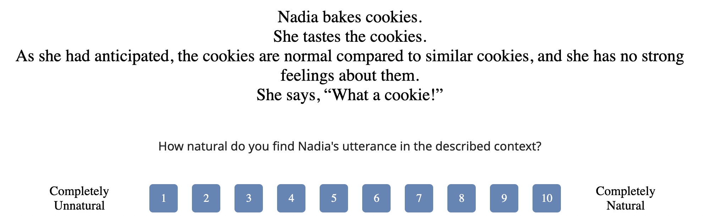
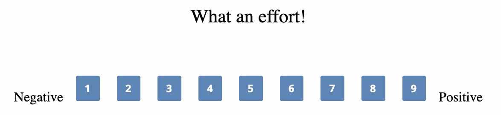

```{r}
library(here)
library(lme4)
library(lmerTest)
library(dplyr)
library(ggplot2)
library(readr)
library(mgcv)
```
```{r}
data_s1 <- read_csv("wh_excl_data_s1.csv", show_col_types = FALSE)
data_s2 <- read.csv("wh_excl_data_s2.csv")
```

# Abstract

## Row {height="100%"}

::: {.card fill="true"}
<div style="max-width: 1200px; margin: auto; padding: 2rem; text-align: justify;">

<h2 style="font-size: 2.6rem; font-weight: bold; margin-bottom: 0.5rem;">Wh-Exclamatives as Valence Setters: An Experimental Investigation</h2>

<p style="font-size: 1.4rem; color: #666; margin-bottom: 1.5rem;">Kalle Glauch · April 2026</p>

<p>This article empirically investigates the semantic meaning of <strong>wh-exclamatives</strong> (e.g., <em>What a view!</em>). Previous literature has identified three distinct meaning components of wh-exclamatives: <strong>±mirativity</strong> (speaker's surprise), <strong>±noteworthiness</strong> (degree of a referent's characteristic), and <strong>±valence</strong> (speaker's strong positive or negative evaluation of the referent).</p>

<p>In <strong>Study 1</strong> (<em>n</em> = 50), participants rated the felicity of wh-exclamatives in contexts manipulated by these three meaning components. The findings indicate that <strong>±noteworthiness</strong> and <strong>±valence</strong>, but not <strong>±mirativity</strong>, influence the felicitous use of wh-exclamatives.</p>

<p><strong>Study 2</strong> (<em>n</em> = 80) examines the role of wh-exclamatives as <strong>linguistic valence setters</strong>, investigating how the construction interacts with the inherent valence of discourse referents to determine the overall valence of embedded referents in a valence rating study. The results reveal that wh-exclamatives have a <strong>polarity-conforming valence-strengthening function</strong>, enhancing the positivity of positive referents and the negativity of negative ones. Neutrally valenced referents are preferentially positivized, indicating a <strong>constructional positivity bias</strong>.</p>

<p style="margin-top: 1.5rem; font-size: 1.4rem;">
<strong>Keywords:</strong> <em>Exclamative Clauses; Valence; Mirativity; Noteworthiness; Valence Setter</em>
</p>

</div>
:::

# Theoretical Background

## Row {height="20%"}

::: {.card title="🔍 Research Focus" fill="true"}
This paper experimentally investigates the meaning of **wh-exclamatives**, focusing specifically on **minimal wh-exclamatives** introduced by *what* and containing no adjective (e.g., *"What a view!"*, *"What a mess!"*, *"What a coincidence!"*), setting aside more complex forms such as *"What a beautiful painting she made!"* or degree exclamatives with *how*.

- Prior literature has proposed three candidate meaning components: **mirativity**, **noteworthiness**, and **emotional valence**.
:::

## Row {height="30%"}

::: {.card title="✨ Mirativity" fill="true"}
Wh-exclamatives express **surprise** about a high degree of some property [@rett2008degree], [-@rett2011exclamatives].

- Widely adopted in formal semantic accounts [@villalba2017issue], [@trotzke2020exclamatives], [@trotzke2024exclamation]
- The speaker is surprised *how beautiful / large / extreme* something is
- Focus is on the **unexpectedness** of the degree
:::

::: {.card title="📊 Noteworthiness" fill="true"}
Wh-exclamatives signal that a referent **stands out** relative to a comparison class [@chernilovskaya2011], [@nouwen2015two].

- Focus is not on surprise, but on **salience** and **extremeness**
- The referent is remarkable relative to what is expected or typical
:::

::: {.card title="❤️ Emotional Valence" fill="true"}
Wh-exclamatives express a **heightened emotional state** — best interpreted as a strong positive or negative valence appraisal [@potts2008exclamatives].

- Strong positive or negative evaluation
- Based on corpus evidence (Amazon Review Corpus)
:::

## Row {height="35%"}

::: {.card title="⚠️ Empirical Gap" fill="true"}
Most claims are based on **introspection** and **isolated examples**, with very little experimental validation. This is especially problematic because wh-exclamatives are **expressives** [@potts2007expressive], [@gutzmann2019grammar], whose meaning is:

- Difficult to paraphrase
- Variable across speakers
- Not truth-conditionally definable
:::

::: {.card title="🎯 Aim of the Paper" fill="true"}
<div style="background-color: #d4edda; border-left: 4px solid #28a745; border-radius: 4px; padding: 12px 16px; margin-top: 8px; font-size: 16px; line-height: 1.6;">
🎯 This paper aims to empirically identify which of the three proposed meaning components — <strong>mirativity</strong> [@rett2011exclamatives], <strong>noteworthiness</strong> [@nouwen2015two], or <strong>emotional valence</strong> [@potts2008exclamatives] — is central to the felicitous use of wh-exclamatives, by testing their contributions through controlled pragmatic experiments rather than relying on introspection.
</div>
:::

# Study 1: Felicity Conditions of Wh-Exclamatives

## Row {height="35%"}

::: {.card title="📋 Study Design" fill="true" width="60%"}
Study 1 investigates the **felicity conditions** of minimal wh-exclamatives in a **2×2×2 within-subject repeated measures design**, fully crossing three binary factors to yield 8 conditions.

- **Task:** Felicity rating task — participants read short vignettes and rated the naturalness of a following wh-exclamative (*"What a(n) x!"*) on a scale from **1 (completely unnatural) to 10 (completely natural)**
- **Items:** 16 experimental items in all 8 conditions, distributed across 8 lists via Latin-Square design; no fillers
- **Participants:** *n* = 50 (*M* age = 46.56, *SD* = 14.32; 36 female, 14 male), recruited via Prolific
- **±Mirativity** — expectations *fulfilled* (e.g., *In line with x's expectations*) vs. *unfulfilled* (e.g., *Contrary to x's expectations*)
- **±Noteworthiness** — referent *superior to most similar entities* (e.g., *nicer than most similar views*) vs. *similar to most* (e.g., *average compared to similar views*)
- **±Valence** — speaker *positively evaluated* referent (e.g., *x finds y very pleasant*) vs. *neutral evaluation* (e.g., *x feels indifferent about y*)
:::

::: {.card title="🖼️ Example Item" fill="true" width="40%"}
{width="100%" fig-align="center"}
:::

## Row {height="65%"}

::: {.card title="📊 Results" fill="true" width="70%"}
```{r}
summary_stats <- data_s1 %>%
  group_by(mirativity, valence, noteworthiness) %>%
  summarize(
    mean_selected = mean(felicity_rating, na.rm = TRUE),
    sd_selected = sd(felicity_rating, na.rm = TRUE),
    se_selected = sd_selected / sqrt(n()),
    ci_lower = mean_selected - qt(0.975, df = n() - 1) * se_selected,
    ci_upper = mean_selected + qt(0.975, df = n() - 1) * se_selected,
    .groups = 'drop'
  )

ggplot(summary_stats, aes(x = valence, y = mean_selected, fill = noteworthiness)) +
  geom_bar(stat = "identity", position = position_dodge(width = 0.9),
           color = "black", linewidth = 0.5) +
  geom_errorbar(aes(ymin = ci_lower, ymax = ci_upper), width = 0.2,
                position = position_dodge(width = 0.9)) +
  geom_point(data = data_s1,
             aes(x = valence, y = felicity_rating, fill = noteworthiness),
             position = position_jitterdodge(dodge.width = 0.9, jitter.width = 0.2),
             shape = 21, size = 2, stroke = 0.5, alpha = 0.6, color = "black") +
  facet_wrap(~ mirativity,
             labeller = labeller(mirativity = c("+" = "+Mirativity", "-" = "-Mirativity"))) +
  labs(x = "Valence", y = "Felicity Rating", fill = "Noteworthiness") +
  theme_minimal() +
  theme(legend.position = "top", axis.text.x = element_text(hjust = 1),
        panel.grid.major = element_blank(), panel.grid.minor = element_blank()) +
  scale_fill_manual(values = c("+" = "#F8A19F", "-" = "#86D4D3")) +
  scale_y_continuous(limits = c(0, 10), breaks = seq(0, 10, 2))
```
:::

::: {.card title="📈 Analysis" fill="true" width="30%"}

**Model** [@barr2013random], [@bates2015package]
```
felicity_rating ~ 
  mirativity * noteworthiness * valence + 
  (1 + valence | submission_id) + (1 | itemname)
```

---

<div class="highlight-box-yellow">
<span style="display: flex; align-items: center; gap: 6px; margin-bottom: 8px;">💡 <strong>Takeaway</strong></span>
<ul>
<li><strong>Valence</strong> is the strongest driver of wh-exclamative felicity (<em>p</em> &lt; 2e-16)</li>
<li><strong>Noteworthiness</strong> is also significant (<em>p</em> = 2.52e-08)</li>
<li>Their interaction is significant (<em>p</em> = .006)</li>
<li><strong>Mirativity</strong> has no reliable effect on felicity ratings</li>
</ul>
</div>
:::

# Study 2: Wh-Exclamatives as Valence-Appraisals

## Row {height="25%"}

::: {.card title="📋 Study Design" fill="true" width="60%"}
Study 2 investigates how embedding in a wh-exclamative changes the **perceived valence** of a discourse referent, building on Study 1's finding that valence is a key meaning component.

- **Task:** Valence rating task — participants saw wh-exclamatives of the form *"What a(n) x!"* and rated the speaker's implied valence of the referent on a scale from **1 (negative) to 9 (positive)**
- **Items:** 200 words drawn from the sentiment dictionary of [@warriner2013norms], split across 2 lists of 100 words each, covering the full valence spectrum
- **Baseline:** Ratings compared against inherent valence norms from [@warriner2013norms], collected using the same procedure
- **Participants:** *n* = 80 (*M* age = 41.61, *SD* = 11.91; 39 female, 38 male, 3 non-binary), recruited via Prolific
- **Hypothesis:** Embedding strengthens valence in a polarity-conforming manner — positive referents become more positive, negative referents more negative
:::

::: {.card title="🖼️ Example Item" fill="true" width="40%"}
{width="100%" fig-align="center"}
:::

## Row {height="75%"}

::: {.card title="📊 Results" fill="true" width="70%"}
```{r}
library(plotly)

data_s2_plot <- data_s2 %>% 
  filter(words != "christmas") %>%
  filter(!is.na(valence_warriner) & !is.na(response))

model2 <- gam(response ~ s(valence_warriner), data = data_s2_plot, method = "REML")

predictions <- predict(model2, newdata = data_s2_plot, se.fit = TRUE)
data_s2_plot$predicted <- predictions$fit
data_s2_plot$conf_low <- predictions$fit - 1.96 * predictions$se.fit
data_s2_plot$conf_high <- predictions$fit + 1.96 * predictions$se.fit

plot_df <- data_s2_plot %>%
  group_by(words) %>%
  summarize(
    inherent_valence = mean(valence_warriner, na.rm = TRUE),
    response_mean = mean(response, na.rm = TRUE),
    ci_low = mean(response, na.rm = TRUE) - 1.96 * sd(response, na.rm = TRUE) / sqrt(n()),
    ci_high = mean(response, na.rm = TRUE) + 1.96 * sd(response, na.rm = TRUE) / sqrt(n())
  ) %>%
  mutate(color = ifelse(words %in% c("buffoon", "lackey", "retard", "jackass", "exterminator"), "red", "black"))

p <- ggplot(data_s2_plot) +
  geom_ribbon(aes(x = valence_warriner, ymin = conf_low, ymax = conf_high), fill = "grey80", alpha = 0.5) +
  geom_line(aes(x = valence_warriner, y = predicted), color = "#54B0B6", size = 0.8) +
  geom_point(data = plot_df, aes(x = inherent_valence, y = response_mean, color = color, text = words), alpha = 0.6, size = 1.5) +
  geom_abline(intercept = 0, slope = 1, linetype = "dashed", color = "black", size = 0.6) +
  xlab("Inherent Valence") +
  ylab("Embedded Valence") +
  scale_x_continuous(breaks = seq(1, 8, by = 1)) +
  scale_y_continuous(breaks = seq(1, 9, by = 1)) +
  scale_color_identity() +
  theme_minimal(base_size = 10) +
  theme(legend.position = "none",
        axis.text.x = element_text(hjust = 1),
        panel.grid.major = element_blank(),
        panel.grid.minor = element_blank())

gg <- ggplotly(p, tooltip = "text")

gg <- gg %>%
  add_trace(data = plot_df,
            x = ~inherent_valence, y = ~response_mean,
            type = "scatter", mode = "none",
            error_y = list(
              type = "data",
              symmetric = FALSE,
              array = ~(ci_high - response_mean),
              arrayminus = ~(response_mean - ci_low),
              color = ~color,
              thickness = 1,
              width = 2
            ),
            showlegend = FALSE,
            hoverinfo = "none") %>%
  layout(
    xaxis = list(title = "Inherent Valence", dtick = 1),
    yaxis = list(title = "Embedded Valence", dtick = 1),
    hovermode = "closest",
    hoverlabel = list(
      font = list(size = 12),
      bgcolor = "white",
      bordercolor = "black"
    )
  )

gg
```
:::

::: {.card title="📈 Analysis" fill="true" width="30%"}

<div class="highlight-box-yellow">
<span style="display: flex; align-items: center; gap: 6px; margin-bottom: 8px;">💡 <strong>Takeaway</strong></span>
<ul>
<li>Wh-exclamatives function as <strong>constructional valence setters</strong>, strengthening inherent valence in a polarity-conforming manner</li>
<li>Negative referents become <strong>more negative</strong>, positive ones <strong>more positive</strong></li>
<li>Neutral to slightly negative referents show a <strong>positivity bias</strong> when embedded</li>
<li>Words used as <strong>particularistic insults</strong> (e.g., <em>buffoon</em>, <em>retard</em>, marked in red) show substantially stronger negativization, likely amplified by knowledge of offensive speaker intent</li>
</ul>
</div>

:::

# References

::: {#refs}
:::
```{=html}
<script>
document.addEventListener('DOMContentLoaded', function() {
  document.querySelectorAll('a[href^="#ref-"]').forEach(function(link) {
    link.addEventListener('click', function(e) {
      e.preventDefault();
    });
  });
});
</script>
```